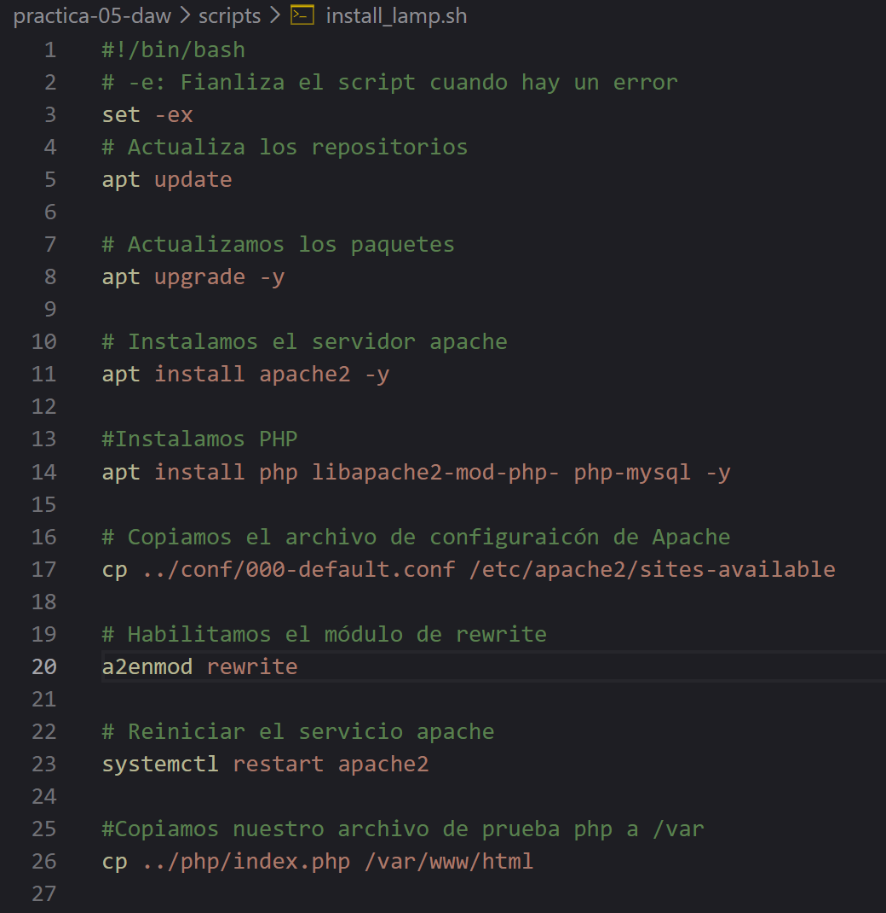
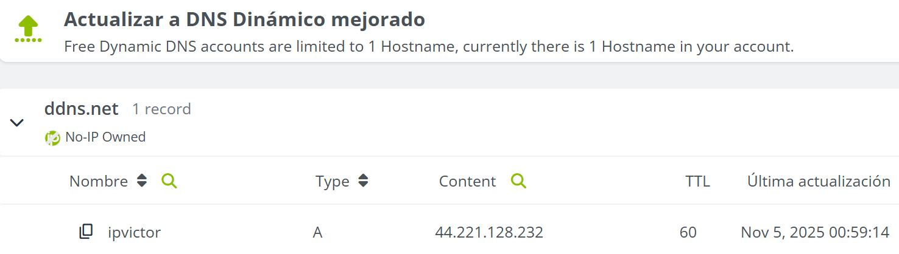
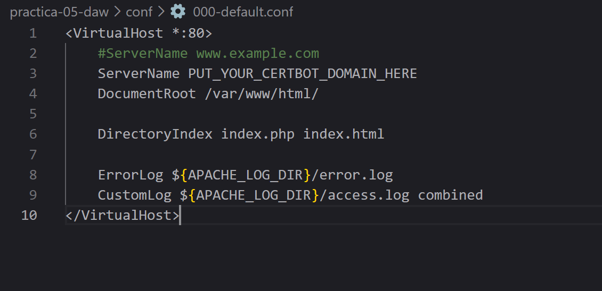
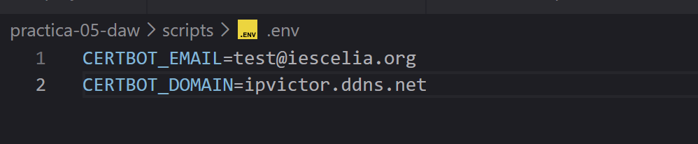
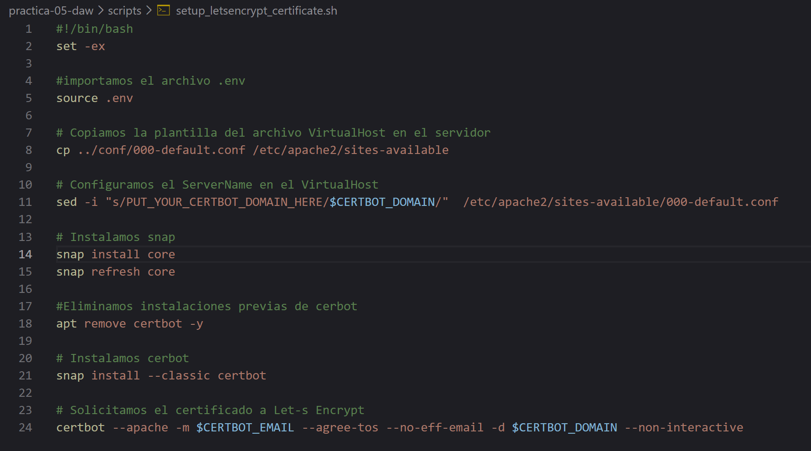
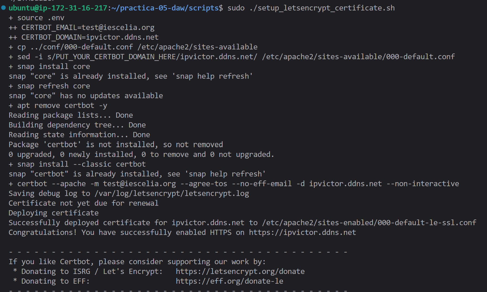
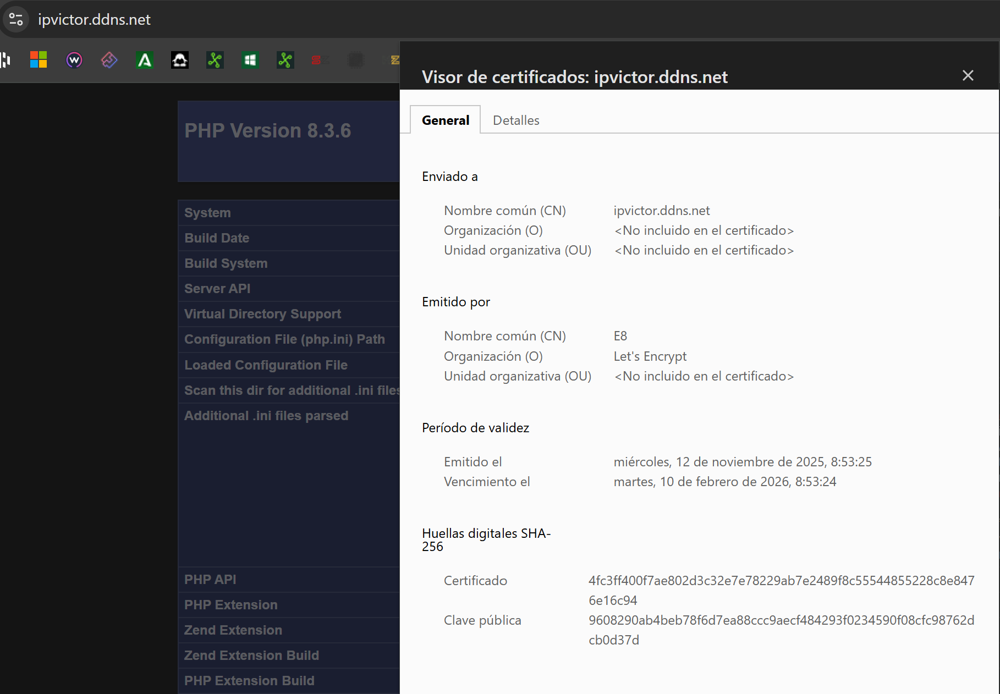

# PRÁCTICA  1.5

## 0. Instalación del Scritp LAMP:
Instalo el Script de Bash con la automatización del proceso de instalación de la pila LAMP.

## 1. Registrar un nombre de dominio:
Registro un nombre de dominio en un proveedor de nombres de domino gratuito (No-Ip)

## 2. Configuración del virtualHost:
Configuro el servicio de VirtualHost introduciendo en el ServerName: PUT_YOUR_CERTBOT_DOMAIN_HERE para que mediante esta variable de entorno en la que cuando ejecute el comando certbot identifique este dominio como propio.

## 3. Configuración del archivo .ENV
Aquí itroduzco las variables de entorno que necesitará Certbot para que identifique el correo y nombre de dominio que registré en la página de
No-ip.

## 4. Creacion de Script Setup_Selfsigned_certificated:
Realizo la creación de este Script para la automatización del proceso de creación y configuración de un certificado SSL/TLS con Let’s Encrypt y Certbot.

## 5. Ejecución del Script Setup_Selfsigned_certificated:
Se comprueba que se ejecuta correctamente el Script, creando de esta manera el certificado seguro del protocolo HTPPS.
 

## 6. Demostración final:
Se demuestra mediante esta imagen que después de todos los pasos realizados anteriormente mi dominio obtiene la certificación y mi página pasa 
a ser segura.
 
